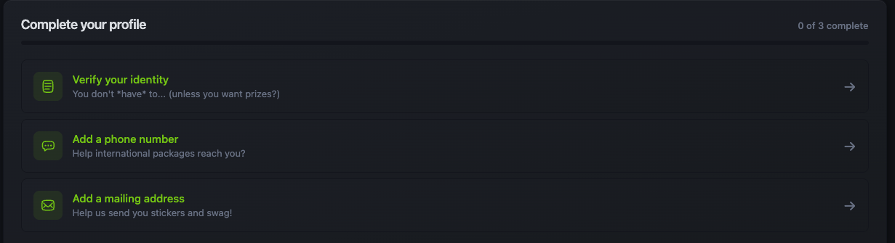

# Hack Club Auth Beállítási Útmutató

## 1. lépés: Fiók Létrehozása

1. Látogass el az [auth.hackclub.com](https://auth.hackclub.com) oldalra
2. Írd be az email címedet a beviteli mezőbe

> **Megjegyzés:** Olyan email címet használj, amelyhez hozzáférsz, mivel emailben fogsz kapni egy hitelesítési kódot.

## 2. lépés: Személyes Adatok

1. Töltsd ki a személyes adataidat **pontosan** és nyomj a **Folytatás** gombra

> **Fontos:** Használd a valódi adataidat, mivel ezekre szükség lesz az azonosításhoz.

## 3. lépés: Email Hitelesítés

1. Nézd meg az emailjeidet a Hack Club által küldött hitelesítési kódért
2. Illeszd be a kódot a weboldal beviteli mezőjébe és nyomj a **Hitelesítés** gombra

## 4. lépés: Csatlakozás a Slackhez

1. Át leszel irányítva a Hack Club Slack oldalára
2. Kattints az **Elfogadom** gombra a feltételek elfogadásához

Gratulálunk! Most már van Hack Club Auth fiókod és Slack profilod is.

## 5. lépés: Üdvözlő Üzenetek

1. Kapsz egy közvetlen üzenetet Ralsei-től a Slacken
2. Olvasd el az üzenetet és kattints a zöld **oké!** gombra

3. Kattints a **hack yeah!** gombra a folytatáshoz

4. Fel leszel szólítva az oldal újratöltésére

**Üdvözlünk a közösségben!** Most már hivatalosan is tagja vagy a Hack Clubnak.

## 6. lépés: Profil Befejezése

1. Menj vissza az [auth.hackclub.com](https://auth.hackclub.com) oldalra
2. Látnod kell három lépést az oldal tetején, amelyeket be kell fejezned
3. Fejezd be mindhárom lépést a profilod hitelesítéséhez

> **Fontos:** Használd a saját, valódi adataidat a hitelesítéshez. Erre szükség van a YSWS-eken való részvételhez.

## Következő Lépések

Nézd meg a Slack útmutatót további információkért a platform használatáról és a közösségbe való bekapcsolódásról!
